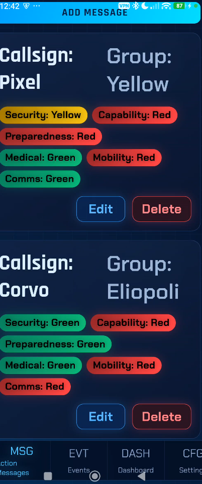

# Reticulum Mobile Emergency Management App

Android-first mobile client for Reticulum Community Hub (RCH), built with
Vue 3 + Capacitor and backed by a local Rust Reticulum + LXMF runtime.

The phone runs Reticulum locally. The app is intended to become a full mobile
client for the RCH client-safe feature surface, while staying offline-first and
usable over mesh-style connectivity.

Current implementation status: the shipped UI in this repo still centers on the
base mobile-node shell (node control, peer discovery, replicated action
messages, and local event tracking). The documented target extends this same
app into full RCH and R3AKT client workflows rather than replacing it with a
separate app.

## Target Product Aim

- Run and manage a local Rust Reticulum + LXMF node on-device
- Act as a first-class RCH client over Reticulum/LXMF instead of feature REST
- Expose typed client operations through the Capacitor plugin and
  `@reticulum/node-client`
- Expand the mobile UX to cover the RCH client-only surface:
  session/status, telemetry, messaging, topics, files/media, markers/zones,
  and R3AKT missions/checklists/teams/assets/assignments

## What is currently implemented

1. Run and control a local Reticulum node
   - Start, stop, and restart the node from the UI
   - Recreate the client runtime without restarting the app
   - Configure announce interval, announce capability string, TCP interfaces, and broadcast
2. Discover and manage peers
   - View peers discovered from announces, Reticulum Community Hub, or imported lists
   - Save/unsave peers locally (allowlist model; discoveries are not auto-saved)
   - Connect/disconnect individual peers, or connect/disconnect all saved peers
   - Label peers and filter by destination/label/capability data
3. Exchange peer allowlists (PeerListV1)
   - Export saved peers as JSON
   - Share on-device (native share sheet) or copy/download on web
   - Import lists in `merge` or `replace` mode
4. Manage Emergency Action Messages
   - Create/update/delete callsign-based status cards
   - Track Security, Capability, Preparedness, Medical, Mobility, and Comms states
   - Replicate updates across connected peers
5. Manage Events
   - Create/delete incident/event timeline entries
   - Replicate event updates across connected peers
6. Monitor dashboard metrics
   - View readiness widgets and peer counts (discovered/saved/connected)

## Data behavior

- Messages, events, settings, and saved peers persist in local storage on-device.
- Current replication uses JSON payloads exchanged over the node packet channel.
- The target RCH client path adds structured LXMF command, result, and event
  envelopes on top of the same local runtime foundation.
- This app does **not** currently auto-seed demo data in runtime startup paths.

## Runtime modes (`clientMode`)

`clientMode` is currently a two-value setting: `auto` or `capacitor`.

- `auto`
  - On mobile runtime profile (`VITE_RUNTIME_PROFILE=mobile`), the store passes
    `mode: "auto"` into `createReticulumNodeClient(...)`.
  - On web runtime profile (`VITE_RUNTIME_PROFILE=web`, default), the store
    always builds the client with `mode: "web"`, so the `clientMode` setting is
    effectively ignored at runtime.
- `capacitor`
  - On mobile runtime profile, the store passes `mode: "capacitor"` into
    `createReticulumNodeClient(...)`.
  - On web runtime profile, stored `capacitor` is normalized back to `auto`,
    and runtime still uses `mode: "web"`.

> Source of truth: runtime mode type and values are defined in
> `apps/mobile/src/types/domain.ts`, and runtime/client construction behavior is
> implemented in `apps/mobile/src/stores/nodeStore.ts`.

## Local development

Rust runtime dependencies for this app are sourced from the sibling consolidated
`LXMF-rs` checkout (`../LXMF-rs`) and validated against commit
`0052218f1247c68f8c925988299d33d0678d81b4`.

From repo root:

1. Install dependencies (once): `npm install`
2. Start app dev server: `npm run mobile:dev`

Validation gates from repo root:

1. `cargo check -p reticulum_mobile`
2. `npm run node-client:build`
3. `npm run mobile:build`

Or from `apps/mobile` directly:

- `npm run dev`

## Build and native sync

From repo root:

1. Build web assets: `npm run mobile:build`
2. Sync Capacitor platforms: `npm --workspace apps/mobile run sync`

Open native projects:

- Android: `npm --workspace apps/mobile run android`
- iOS: `npm --workspace apps/mobile run ios`

## Android production build (signed)

1. Build and sync web assets:
   - From repo root: `npm --workspace apps/mobile run build`
   - From `apps/mobile`: `npx cap sync android`
2. Build signed Android release artifacts:
   - From `apps/mobile/android`: `cmd /c gradlew.bat assembleRelease bundleRelease`

Outputs:

- APK: `apps/mobile/android/app/build/outputs/apk/release/<app-name>-v<versionName>-release.apk`
- AAB (default): `apps/mobile/android/app/build/outputs/bundle/release/app-release.aab`
- AAB (renamed copy): `apps/mobile/android/app/build/outputs/bundle/release/<app-name>-v<versionName>-release.aab`

Release builds auto-generate:

- `versionCode` from UTC timestamp (`yyDDDHHmm`)
- `versionName` as `1.0.<yyyyMMddHHmmss>`
- artifact file names containing the application name and version

## Local signing config

Release signing is loaded from `apps/mobile/android/keystore.properties` (ignored by git).

Expected keys in `keystore.properties`:

- `storeFile` (example: `keystore/reticulum-mobile-release.jks`)
- `storePassword`
- `keyAlias`
- `keyPassword`
